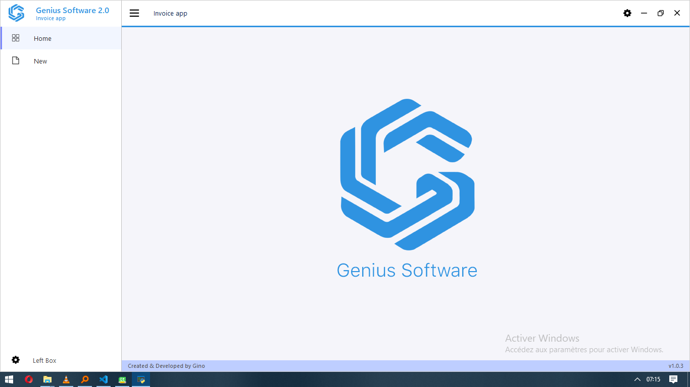

# GUI With PySide 6 & Qt Designer

 

### Install Library

```console
pip install PySide6
```

## convert .ui to .py & qrc to .py
``` console
pyside6-uic view/main.ui -o modules/ui_main.py
pyside6-rcc view/resources.qrc -o modules/resources_rc.py
```
To import resources in <code> modules/ui_main.py </code>
```python
from . resources_rc import *
```

### Run
```console
python main.py
```